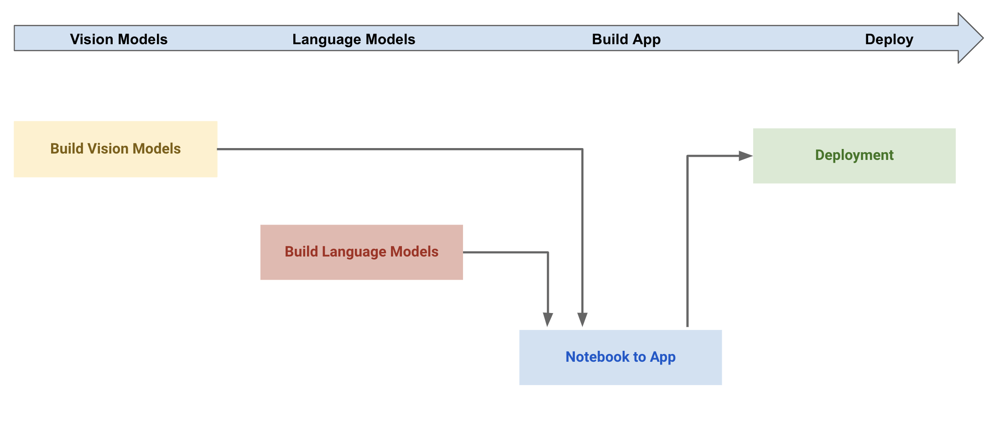
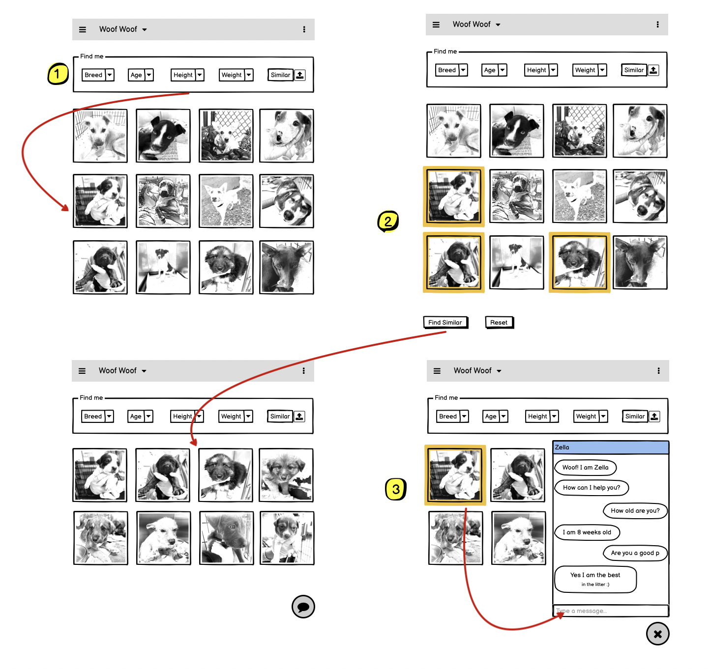
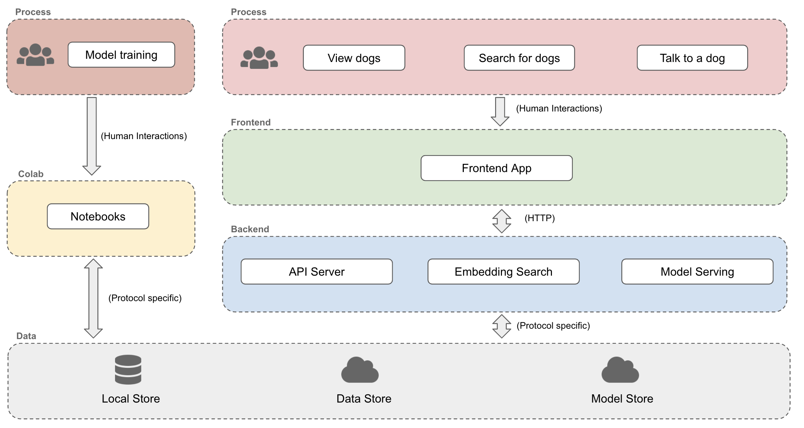
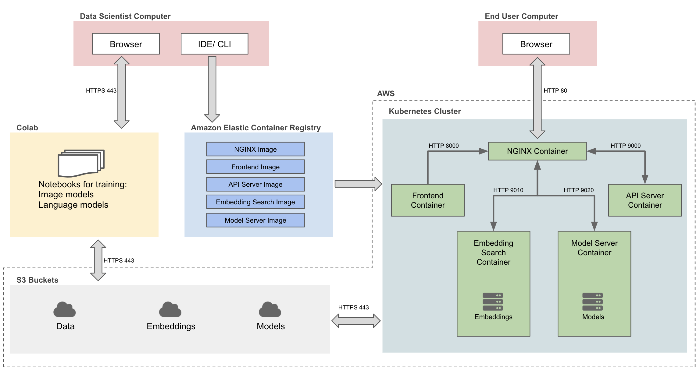

# 2021 IACS ComputeFest

# ComputeFest Videos
[January 19th Tuesday Morning](https://harvard.zoom.us/rec/share/1vRaQNVCgZ69fGg9K98F9SoSlgz3iTOpD7HTpFD_tSToq_g_onUSzIPLndaxX2q5.OXnnK6l4f2sG93us) - 
[January 19th Tuesday Afternoon](https://harvard.zoom.us/rec/share/rpu8Chtpv7oVYpXNdwBK1xPhyIE4uR-DMMY3SM6-hEg1dKgzpeNaWjrj9hosJGDO.DD1aYyieR2VjQ1aT)

[January 20th Wednesday Morning](https://harvard.zoom.us/rec/share/3cisw4RBDKDWLX0j0F_q6Pmy9-XTEJgHEGd-Ve3YvodPlKPAyolkP_9aVEQL1hAT.WArYO2Br98ngtJ1u?startTime=1611154931000) - 
[January 20th Wednesday Afternoon](https://harvard.zoom.us/rec/share/2c1-KPljv05oa33XmJgbKaJ4RneFwdx-NzDdHKAFaQv78sQu6BSz1lLcFTN-ABbI.3D3-O5K1ml1m22hT?startTime=1611167499000)

[January 21st Thursday Morning](https://harvard.zoom.us/rec/share/Bg0lQ4zqdit7nysCz7enTd8kz_qBVYx3p8yAA359kE5dhQXbuk8mh7BwhH3YpmkP.13ahCQ4RefEfKdR4) - 
[January 21st Thursday Afternoon](https://harvard.zoom.us/rec/share/7vnr67X_XVuzKgb9jILmhJYCEqr-SX6-X_QYIh1_DuiB4aMIN5rkVjSwx-PBYbsF.wJGTxQO00-Y0ewPm?startTime=1611253924000)

[January 22nd Friday Morning](https://harvard.zoom.us/rec/share/RFA69-Rb-zoY_VLDb4YwD1iUKJ0LUZP4oQtVMQnLzSP-swy9QwOvKj4uMNLszeju.DNnG9BTGvQo0jWC1?startTime=1611327707000) - 
[January 22nd Friday Afternoon](https://harvard.zoom.us/rec/share/gkiq_L0bChhw8FUj704LpnIoLVP_ZTv7kjqrJi1rvzzA1zotrBZ6fXvV_3JGMLM_.XRttfMxtxTTEINr5?startTime=1611340332000)


## 🐶 Woof Woof! - Project Details

### Background
For Computefest 2021, Harvard IACS will be creating hands-on workshops that will be an in-depth tutorial on transfer learning for computer vision and language models, building applications using deep learning models and deploying them in production. The outcome of the four days workshop will be to build a full featured application for the Austin Pets Alive (APA). APA is an association of pet owners for pet owners. Our goal will be to build a reusable application, design, and framework that can be used in any animal welfare nonprofits to connect future pet owners with pets.

### Problem Statement
For the scope of the workshops we will focus on creating a user friendly tool that helps connect future dog owners with dogs available for adoption. The core problem we are trying to solve is to help future dog owners find a dog who is a good fit for their lifestyle and family environment. First we help the user search for dogs based on certain features such as size and color. Secondly we will connect the dog with the user by allowing the user to chat with a persona of the dog. The user can ask this virtual dog any question about it, its breed characteristics, or any general questions about puppies and dogs.


### Workshop Workflow



#### Build Vision Models:
Workshop will be an in-depth tutorial on transfer learning for computer vision. Will cover state of the art models and how to perform transfer learning in general with practical examples. Topics that will be covered:

**Concepts**:
- CNNs
- Transfer learning
- SOTA models
- Network distillation

**Workshops**:
- Image classification
- Feature extraction
- Create embeddings
- Distillation

#### Build Language Models:
Workshop will be an in-depth tutorial on transfer learning for natural language. Will cover state of the art models and how to perform transfer learning in general with practical examples. Topics that will be covered:

**Concepts**:
- Seq2Seq
- Attention & Self-attention
- Transformers
- Transfer learning
- SOTA models

**Workshops**:
- Language models
- Question answering models
- Dialog models

#### Notebook to App:
Workshop will be an in-depth tutorial on bringing code from notebooks to self contained environments. Will cover different options for python environments with a primary focus on containerized development. Topics that will be covered:

**Concepts**:
- Virtual environments
- Virtual machines
- Containers
- Microservices/APIs

**Workshops**:
- Code optimization
- Creating Docker containers
- Building and running the app containers

#### Deployment:
Workshop will be an in-depth tutorial on deploying containers to the AWS cloud environment. Topics that will be covered:

**Concepts**:
- Amazon Web Services (AWS)
- AWS Classrooms
- Kubernetes

**Workshops**:
- Setup Kubernetes cluster
- Deploy app to AWS


### App Design



#### Flow:
- User can find dogs using “Find me” filters
- Select one or more dogs to find dogs similar to the selected ones
- Select a dog to chat with. This opens up a personalized chatbot for the selected dog


**Home Page**:
- Default page when app starts up
- Top “n” dogs shown by default
- Image card displays name and image of dog
- Image cards are selectable (multiple)
- “Find Similar” button shows up when one or more image cards are selected

**Find me Search/Filter**:
- The search/filter section will stay on each page
- Allows filter by:
    - Breed 
    - Age (range)
    - Height (range)
    - Weight (range)
- Similar - an image upload to find dogs similar to the dog in the uploaded picture
The filter will get applied on change of any of the filter elements and refresh the image grid

**Select a dog to chat with it**:
- Image cards in the image grid display a “chat” icon for each dog
- Click on “chat” icon to open up a chat popup
- The chatbot active will be specific to the dog selected
- Dog chat bot can answer basic question about itself + other general questions about the breed + some general question about dogs

### Solution Architecture



**Process**:
- Data Scientists can perform model training
- Users can view dogs available for adoption
- Users can search for dogs based on various filter conditions
- User can select a dog and “talk” to it

**Colab**:
- Web based hosted notebook solution from Google with access to GPU for model training

**Frontend**:
- User friendly single page app with capabilities to view and search dogs
- Chatbot

**Backend**:
- API Server to expose dog metadata
- Embedding Search service to find images that are similar to a give image or images
- Model Serving to serve the models for inference 

**Data**:
- Local file or database store
- Cloud data store
- Cloud model store


### Technical Architecture



**Colab**:
- Google Colab will be used for model training of image and language models
- Trained models will be saved in AWS S3 buckets

**Elastic Container Registry (ECR)**:
- ECR Hub will be used to host all the container images

**AWS S3 Bucket Store**:
- S3 buckets will be used as a common storage repositories for data, embeddings, and models

**Kubernetes Cluster**:
- Kubernetes cluster will be used to deploy the various containers on AWS


# 🐶 Woof Woof App! - Deploy to GCP

## Prerequisites
### Install Docker 
Install `Docker Desktop`

### Install VSCode  
Follow the [instructions](https://code.visualstudio.com/download) for your operating system.  
If you already have a preferred text editor, skip this step.  

### Clone the github repository
- Clone or download [this repository](https://github.com/Harvard-IACS/computefest2021)
- Extract the repository if you had downloaded it

## Create a secrets folder
Create a folder called `secrets` under the extracted folder `woof-woof-app`. Add a GCP credential file (*.json) with the service account having the following permissions:
```
Compute Admin
Compute OS Login
Kubernetes Engine Admin
Container Registry Service Agent
Service Account User
Storage Admin
```

## Open a terminal window
Go to the location where you had extracted the github repository. Change directory into `woof-woof-app` and list the directories to make sure you can see the same directories below
```
shivasj@shivas-jayaram-2 woof-woof-app % ls -1 -d */
backend-api/
backend-embedding-search/
backend-model-server/
deploy_attempt1/
deployment/
frontend/
imgs/
secrets/
```

## Build & Run Kubernetes Docker Container
- Open a new terminal tab at `woof-woof-app` 
- Run `cd deployment`
- Run `ls` and you should see these content:
```
shivasj@shivas-jayaram-2 deployment % ls -1
Dockerfile
ansible.cfg
deploy_cluster.yml
deploy_images.yml
docker-devshell.sh
docker-entrypoint.sh
environment.shared
inventory.yml
```

- Edit the environment.shared file to put int your GCP specific variables. Make sure to change GCP_PROJECT & GOOGLE_APPLICATION_CREDENTIALS
```
export IMAGE_NAME="woofwoof-deployment"
export GCP_PROJECT="mlproject01-207413"
export GCP_ZONE="us-east1-c"
export GOOGLE_APPLICATION_CREDENTIALS=/secrets/ansible.json
```

- Edit the inventory.yml file to put int your GCP project details
```
all:
    vars:
      gcp_project: "mlproject01-207413"
```

- Run `sh ./docker-devshell.sh`. This command will build and run your container. If everything goes fine you should see something like this:
```
Successfully built c53eddc8c5ef
Successfully tagged simple-trainer-kubernetes-gcp:latest
Container is running!!!
Activated service account credentials for: [ansible@mlproject01-207413.iam.gserviceaccount.com]
Updated property [core/project].
Adding credentials for: gcr.io
Docker configuration file updated.
root@000f3d654417:/app#
```

## Create cluster
- Run `gcloud container clusters create woof-woof-cluster --num-nodes 2 --zone us-east1-c`. This will create a cluster in GCP using the creditainls and GCP project supplied in `environment.shared`. This should take a few minutes after which you will see an output similar to this:
```
root@4de71bd2cf6c:/app# gcloud container clusters create woof-woof-cluster --num-nodes 2 --zone us-east1-c
WARNING: Starting in January 2021, clusters will use the Regular release channel by default when `--cluster-version`, `--release-channel`, `--no-enable-autoupgrade`, and `--no-enable-autorepair` flags are not specified.
WARNING: Currently VPC-native is not the default mode during cluster creation. In the future, this will become the default mode and can be disabled using `--no-enable-ip-alias` flag. Use `--[no-]enable-ip-alias` flag to suppress this warning.
WARNING: Starting with version 1.18, clusters will have shielded GKE nodes by default.
WARNING: Your Pod address range (`--cluster-ipv4-cidr`) can accommodate at most 1008 node(s). 
WARNING: Starting with version 1.19, newly created clusters and node-pools will have COS_CONTAINERD as the default node image when no image type is specified.
Creating cluster woof-woof-cluster in us-east1-c... Cluster is being health-checked (master is healthy)...done.                                                                                                                              
Created [https://container.googleapis.com/v1/projects/mlproject01-207413/zones/us-east1-c/clusters/woof-woof-cluster].
To inspect the contents of your cluster, go to: https://console.cloud.google.com/kubernetes/workload_/gcloud/us-east1-c/woof-woof-cluster?project=mlproject01-207413
kubeconfig entry generated for woof-woof-cluster.
NAME               LOCATION    MASTER_VERSION    MASTER_IP      MACHINE_TYPE   NODE_VERSION      NUM_NODES  STATUS
woof-woof-cluster  us-east1-c  1.16.15-gke.6000  35.237.135.93  n1-standard-1  1.16.15-gke.6000  2          RUNNING
```

## Build & Push Docker Images to GCR
We will use an Ansible Playbook to build and push all required docker images
- Run `ansible-playbook deploy_images.yml -i inventory.yml`. This will take a few mintues but if everything goes fine you will see something like this:
```
root@4de71bd2cf6c:/app# ansible-playbook deploy_images.yml -i inventory.yml
[WARNING]: provided hosts list is empty, only localhost is available. Note that the implicit localhost does not match 'all'

PLAY [Build docker images and push them to GCR] ***********************************************

TASK [Build backend-api container image] *****************************************
ok: [localhost]

TASK [Push backend-api image to GCR] ************************************
ok: [localhost]

TASK [Build backend-embedding-search container image] *****************************************************
ok: [localhost]

TASK [Push backend-embedding-search image to GCR] ***********************************************
ok: [localhost]

TASK [Build backend-model-server container image] *************************************************
changed: [localhost]

TASK [Push bbackend-model-server image to GCR] ***********************************************
changed: [localhost]

TASK [Build frontend container image] **************************************
changed: [localhost]

TASK [Push frontend image to GCR] *********************************
changed: [localhost]

PLAY RECAP **********************
localhost                  : ok=8    changed=4    unreachable=0    failed=0    skipped=0    rescued=0    ignored=0   
```

## Deploy Woof Woof App to Kubernetes Cluster
We will use an Ansible Playbook to deploy our entire app to Kubernetes
- Run `ansible-playbook deploy_cluster.yml -i inventory.yml`. This will take a few minutes to run and the output should look like this:
```
root@4de71bd2cf6c:/app# ansible-playbook deploy_cluster.yml -i inventory.yml
[WARNING]: provided hosts list is empty, only localhost is available. Note that the implicit localhost does not match 'all'

PLAY [Deploy Woof Woof App to Kubernetes Cluster] *************************************************

TASK [Create Namespace] *************************************************
changed: [localhost]

TASK [Add nginx-ingress helm repo] ***************************************************
ok: [localhost]

TASK [Install nginx-ingress] **************************************************
changed: [localhost]

TASK [Create Deployment for backend-api] ***************************************************
changed: [localhost]

TASK [Create Deployment for backend-embedding-search] *************************************************
changed: [localhost]

TASK [Create Deployment for backend-model-server] *************************************************
changed: [localhost]

TASK [Create Deployment for frontend] *******************************************************
changed: [localhost]

TASK [Create Service for backend-api] ******************************************************
changed: [localhost]

TASK [Create Service for backend-embedding-search] ****************************************************
changed: [localhost]

TASK [Create Service for backend-model-server] *****************************************************
changed: [localhost]

TASK [Create Service for frontend] ****************************************************
changed: [localhost]

TASK [Wait for Ingress Nginx to get ready] *****************************************************
FAILED - RETRYING: Wait for Ingress Nginx to get ready (20 retries left).
FAILED - RETRYING: Wait for Ingress Nginx to get ready (19 retries left).
FAILED - RETRYING: Wait for Ingress Nginx to get ready (18 retries left).
changed: [localhost]

TASK [Set Nginx Ingress IP] ******************************************************
ok: [localhost]

TASK [Debug Ingress Nginx IP Address] *******************************************************
ok: [localhost] => {
    "msg": "Ingress Nginx IP Address: 35.237.198.127"
}

TASK [Debug vars] ******************************************************
ok: [localhost] => {
    "nginx_ingress_ip": "35.237.198.127"
}

TASK [Create Ingress Controller] ******************************************************
changed: [localhost]

PLAY RECAP ****************************************************
localhost                  : ok=16   changed=12   unreachable=0    failed=0    skipped=0    rescued=0    ignored=0   

root@4de71bd2cf6c:/app# 

```

The app will be running at the `nginx_ingress_ip` in this case http://35.237.198.127.xip.io/
