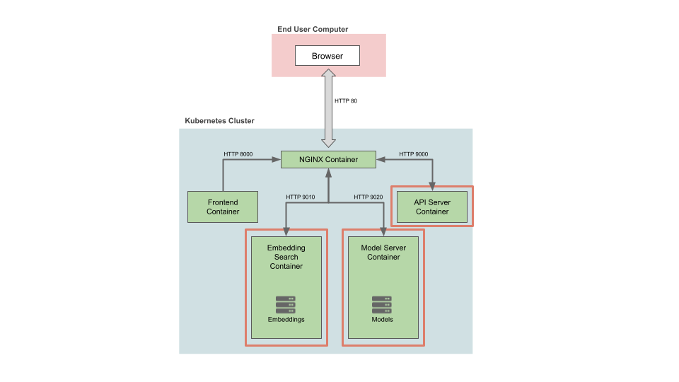
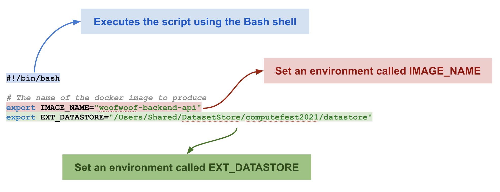
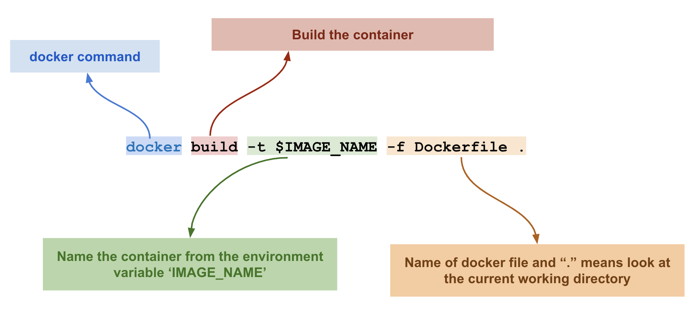
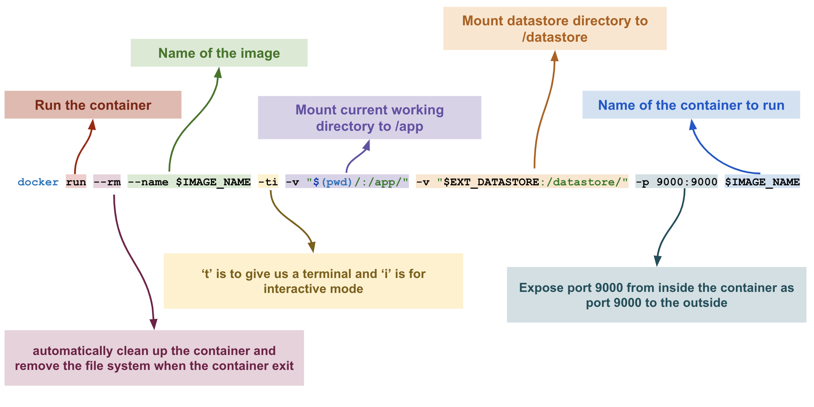

# Woof Woof App!

The goal for this lab will be to setup, run, and test the three containers highlighted in the image below.



## Prerequisites
### Install Docker 
Install `Docker Desktop`

#### Ensure Docker Memory
- To make sure we can run multuple container go to Docker>Preferences>Resources and in "Memory" make sure you have selected > 4GB

### Install VSCode  
Follow the [instructions](https://code.visualstudio.com/download) for your operating system.  
If you already have a preferred text editor, skip this step.  

### Clone the github repository
- Clone or download [this repository](https://github.com/Harvard-IACS/2021-ComputeFest)
- Extract the repository if you had downloaded it

## Create a Datastore folder
Create a folder where you would like to store the datasets and models. For example I created one like
`/Users/Shared/DatasetStore/computefest2021/datastore`. Keep a note of this folder path because we will need it later.

## Open a terminal window
Go to the location where you had extracted the github repository. Change directory into `woof-woof-app` and list the directories to make sure you see the same as below
```
shivasj@shivas-jayaram-2 computefest2021 % 
shivasj@shivas-jayaram-2 computefest2021 % cd woof-woof-app
shivasj@shivas-jayaram-2 woof-woof-app % ls
Lab.md				
backend-model-server
backend-api			
backend-embedding-search
```

## Windows users please use the corresponding `.bat` files in the instructions

## Build & Run Docker Containers
We plan to build our app using 4 containers. Today, we will build the first 3 and tomorrow we will build the final one. The
three containers we will be creating today are:
- Backend API Container
- Backend Embedding Search Container
- Backend Model Server Container

#### Backend API Container
##### Build & Run
- Open a new terminal tab at `woof-woof-app` or reuse the one from the previous step
- Run `cd backend-api`
- Run `ls` and you should see these content:
```
├── Dockerfile
├── Pipfile
├── Pipfile.lock
├── README.md
├── api
├── docker-devshell.sh
├── docker-entrypoint.sh
└── environment.shared
```
- Open the file `environment.shared` and edit the line `export EXT_DATASTORE="<path to your datastore folder>"` to the path you created for the step `Create a Datastore folder`
- Run `sh ./docker-devshell.sh`. This command will build and run your container. You should see a lot of output on the
  screen. If everything goes fine you should see something like the following near the very end:
```
Successfully built 53e5b1238a9b
Successfully tagged woofwoof-backend-api:latest
Container is running!!!

The following commands are available:
    apiserver
        Run the API Server

Launching subshell in virtual environment...
app@30fcbbe30491:/app$  . /home/app/.local/share/virtualenvs/app-4PlAip0Q/bin/activate
(app) app@30fcbbe30491:/app$ 
```

##### Let us examine what we just did
- Open the file `environment.shared`. Note that you won't be able to open this in the Docker container that you just started
  up. You will need to open this in the original terminal.

- Open the file `docker-devshell.sh` and let's breakdown what `docker build -t $IMAGE_NAME -f Dockerfile .` is doing.
  


  Next let's look at  what `docker run --rm --name $IMAGE_NAME -ti -v "$(pwd)/:/app/" -v "$EXT_DATASTORE:/datastore/" -p 9000:9000 $IMAGE_NAME` is doing.



- Open the file `Dockerfile` and let's review it
    - Creating a user called app
    - Expose 9000 is used so that the container listens to port 9000 at runtime
    - Installing the right python packages
- Open the file `docker-entrypoint.sh` and let's review it
    - We run a `uvicorn` server at port 9000

##### Run the API Server
- From the docker shell run the command `apiserver` and, after a few minutes, you should see something like this:
```
(app) app@30fcbbe30491:/app$ apiserver
INFO:     Uvicorn running on http://0.0.0.0:9000 (Press CTRL+C to quit)
INFO:     Started reloader process [14] using statreload
INFO:     Started server process [16]
INFO:     Waiting for application startup.
ensure_data_loaded()
INFO:     Application startup complete.
```
- Go to http://0.0.0.0:9000 on your browser and you should see the following output
```
{"message":"Welcome to the API Service"}
```
- Stop the api server by doing a control+c in the terminal

##### Adding API routes to the server
- Open the file `api/service.py` and let's review it
  - FastAPI app
  - Enable CORS
  - In the `startup()` function uncomment the line `api_utils.ensure_data_loaded()`
  
```
@app.on_event("startup")
async def startup():
    api_utils.ensure_data_loaded()
    pass
```
  - This loads the data required for our container if it does not already exist
  - Next go to the end of the file and uncomment the line `app.include_router(data.router, prefix=prefix)`
- Open the file `api/routers/data.py` and let's review it
  - Review the function `load_dogs()`
  - Review `@router.get(/breeds)`
  
- From the docker shell run the command `apiserver` to start the api server
- Go to http://0.0.0.0:9000/v1/breeds on your browser and check if you get the list of breeds
- Go to http://0.0.0.0:9000/docs on your browser to view the various apis available
  - You can test the various apis using this page
  
- Examples apis to test (You can use the browser or /docs tester)
  - http://0.0.0.0:9000/v1/dogs - Get a sample list of dogs
  - http://0.0.0.0:9000/v1/dogs
  - Use the api tester for the route /v1/dogs and enter a value for "dog breed ot filter by" parameter
  - The same test in the browser would be http://0.0.0.0:9000/v1/dogs?breed=Boxer%2FMix
  - Use the api tester for the route /v1/view_image and enter 16533278 for animal id and 20191013190242.png for image id
  - Feel free to try different parameters to test out your apis

Congratulations! You have an API Server up and running  

---

#### Backend Embedding Search Container
##### Build & Run
- Open a new terminal tab at `woof-woof-app`
- Run `cd backend-embedding-search`
- Run `ls` and you should see these content:
```
├── Dockerfile
├── Pipfile
├── Pipfile.lock
├── README.md
├── docker-devshell.sh
├── docker-entrypoint.sh
├── embedding
└── environment.shared
```
- Open the file `environment.shared` and edit the line `export EXT_DATASTORE="<path to your datastore folder>"` to the path you created for the step `Create a Datastore folder`
- Run `sh ./docker-devshell.sh`. This command will build and run your container. If everything goes fine you should see something like this:
```
Successfully built 2c61ddd954e1
Successfully tagged woofwoof-embedding-server:latest
Container is running!!!

The following commands are available:
    embeddingserver
        Run the Embedding Server

Launching subshell in virtual environment...
app@e80f1ba0bf97:/app$  . /home/app/.local/share/virtualenvs/app-4PlAip0Q/bin/activate
(app) app@e80f1ba0bf97:/app$ 
```

##### Run the Embedding Server
- From the docker shell run the command `embeddingserver` and you should see something like this:
```
(app) app@30fcbbe30491:/app$ apiserver
INFO:     Uvicorn running on http://0.0.0.0:9010 (Press CTRL+C to quit)
INFO:     Started reloader process [14] using statreload
INFO:     Started server process [16]
INFO:     Waiting for application startup.
ensure_data_loaded()
INFO:     Application startup complete.
```
- Go to http://0.0.0.0:9010 on your browser and you should see the following output
```
{"message":"Welcome to the Embedding Server"}
```
- Stop the embeddingserver by doing a control+c in the terminal

##### Adding routes to the server
- Open the file `embedding/service.py`
  - In the `startup()` function uncomment the line `embedding_utils.ensure_data_loaded()`
  
```
@app.on_event("startup")
async def startup():
    embedding_utils.ensure_data_loaded()
    pass
```
  - This loads the data required for our container if it does not already exist
  - Next go to the end of the file and uncomment the line `app.include_router(search.router, prefix=prefix)`

- From the docker shell run the command `embeddingserver` to start the embedding server
- Go to http://0.0.0.0:9010/docs on your browser to view the various routes available
  - You can test the various routes using this page
  
- Example routes to test (You can use the browser or /docs tester)
  - Use the api tester for the route /v1/find_similar_from_ids and enter a value ids as 20191013190242.png (this could be a comma separated list of multiple file names)
  - The same test in the browser would be http://0.0.0.0:9010/v1/find_similar_from_ids?ids=20191013190242.png

Congratulations! You have Embedding Search Server up and running using the embeddings created in day 1

---

#### Backend Model Server Container
##### Build & Run
- Open a new terminal tab at `computefest2021`
- Run `cd backend-model-server`
- Run `ls` and you should see these content:
```
├── Dockerfile
├── Pipfile
├── Pipfile.lock
├── README.md
├── docker-devshell.sh
├── docker-entrypoint.sh
├── environment.shared
└── serving
```
- Open the file `environment.shared` and edit the line `export EXT_DATASTORE="<path to your datastore folder>"` to the path you created for the step `Create a Datastore folder`
- Run `sh ./docker-devshell.sh`. This command will build and run your container. If everything goes fine you should see something like this:
```
Successfully built 0c20b6ed80ea
Successfully tagged woofwoof-backend-model-server:latest
Container is running!!!

The following commands are available:
    modelserver
        Run the Model Server

Launching subshell in virtual environment...
app@4afff361cb0b:/app$  . /home/app/.local/share/virtualenvs/app-4PlAip0Q/bin/activate
(app) app@4afff361cb0b:/app$
```

##### Run the Model Server
- From the docker shell run the command `modelserver` and you should see something like this:
```
(app) app@30fcbbe30491:/app$ apiserver
INFO:     Uvicorn running on http://0.0.0.0:9020 (Press CTRL+C to quit)
INFO:     Started reloader process [14] using statreload
INFO:     Started server process [16]
INFO:     Waiting for application startup.
ensure_data_loaded()
INFO:     Application startup complete.
```
- Go to http://0.0.0.0:9020 on your browser and you should see the following output
```
{"message":"Welcome to the Model Server"}
```
- Stop the modelserver by doing a control+c in the terminal

##### Adding routes to the model server
- Open the file `serviing/service.py`
  - In the `startup()` function uncomment the line `serving_utils.ensure_data_loaded()`
  
```
@app.on_event("startup")
async def startup():
    serving_utils.ensure_data_loaded()
    pass
```
  - This loads the data required for our container if it does not already exist
  - Next go to the end of the file and uncomment the line `app.include_router(models.router, prefix=prefix)`

- From the docker shell run the command `modelserver` to start the model server
- Go to http://0.0.0.0:9020/docs on your browser to view the various routes available
  
- Example route to test
  - There is only one route to test which is a POST operation for route /v1//chat_with_dog
  - Here is an example request body to put in the tester to test a dialog with your language model
  
```json
{
   "dog":{
      "AnimalID":77338,
      "AnimalInternalID":16918685,
      "AnimalName":"Reese",
      "AnimalType":"Dog",
      "AnimalSex":"Male",
      "AnimalCurrentWeightPounds":15.56,
      "AnimalDOB":20190730,
      "Year":2019,
      "Age":1,
      "AnimalBreed":"Terrier/Mixed Breed (Medium)",
      "AnimalColor":"Cream/None",
      "ImageID":"20191026161437.png"
   },
   "history":[
      "hi there. i'm reesei am a",
      "what breed are you?",
      "my breed is terrier/mixed breed (",
      "do you like to play with toys?",
      "yes i do i love toys"
   ],
   "input_message":"Are you house trained?"
}
```
  

Congratulations! You have a Model Server up and running capable of chatting with model you created in day 2

---
