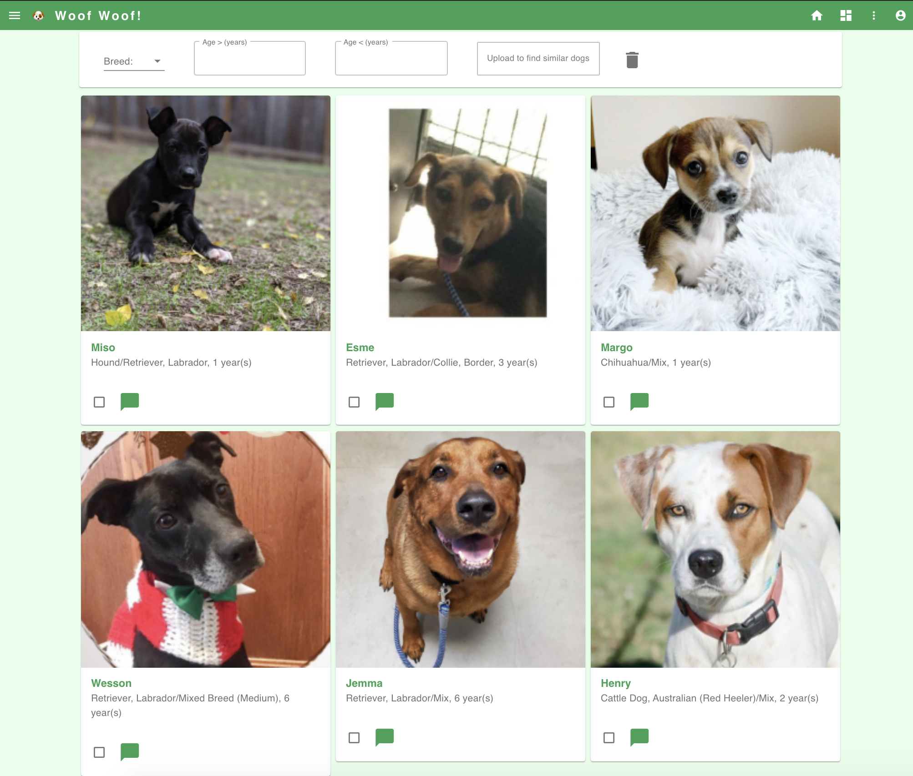

# 🐶 Woof Woof App!

The goal for this lab will be to setup and run the entire woof woof app 🐶.


## Prerequisites
### Install Docker 
Install `Docker Desktop`

### Install VSCode  
Follow the [instructions](https://code.visualstudio.com/download) for your operating system.  
If you already have a preferred text editor, skip this step.  

### Clone the github repository
- Clone or download [this repository](https://github.com/Harvard-IACS/2021-ComputeFest)
- Extract the repository if you had downloaded it

## Create a Datastore folder
Create a folder where you would like to store the datasets and models. For example I created one like `/Users/Shared/DatasetStore/computefest2021/datastore`. Keep a note of this folder as we will need it later.

## Open a terminal window
Go to the location where you had extracted the github repository. Change directory into `woof-woof-app` and list the directories to make sure you see the same as below
```
shivasj@shivas-jayaram-2 computefest2021 % 
shivasj@shivas-jayaram-2 computefest2021 % cd woof-woof-app
shivasj@shivas-jayaram-2 woof-woof-app % ls
Lab.md				
backend-model-server
backend-api			
backend-embedding-search
frontend
```

## Build & Run Docker Containers
For this app we will be using 4 containers
- Backend API Container (Follow day 3 instructions)
- Backend Embedding Search Container (Follow day 3 instructions)
- Backend Model Server Container (Follow day 3 instructions)
- Frontend Container

### Ensure all Backend Containers are running
You will need to make sure the following services are running:
- apiserver
- embeddingserver
- modelserver

#### Frontend Container
##### Build & Run
- Open a new terminal tab at `woof-woof-app` 
- Run `cd frontend`
- Run `ls` and you should see these content:
```
├── Dockerfile
├── Dockerfile.dev
├── README.md
├── docker-devshell.sh
├── environment.shared
├── package-lock.json
├── package.json
├── public
├── src
└── yarn.lock
```

- Run `sh ./docker-devshell.sh`. This command will build and run your container. If everything goes fine you should see something like this:
```
Successfully built 80d294f14c77
Successfully tagged woofwoof-frontend:latest
app@0694cc1e5bb2:/app$
```

- Run `npm start` to start the react app and wait for the app to start up
- Go to http://0.0.0.0:3000 on your browser and you should see the app up and running


##### Test App
- Select a breed and see if your list of dogs filter based on selection
- Select one or more dogs and click "Find similar dogs to selection(s)" and view similar dogs
- Upload a picture of a dog and find dogs similar to it
- Click the chat icon and start a conversation with the dog. Example questions you could ask are "How old are you?", "Are you house trained?", "Do you like toys?", "What is your breed?"

##### Review Code
Now we will spend sometime reviewing the frontend code and how the frontend app access the API's we created yesterday


# Deployment of App to Kubernetes

In this section we will deploy the app to a kubernetes cluster in AWS. We will be following these steps:
- Authenticate
- Create an Elastic Container Registry (ECR) (This is equivalent to Docker Hubs container registry)
- Build docker images and push to ECR
- Deploy all components of our app to AWS EKS
- Test the app using its public URL

## Prerequisites
### Install kubectl
https://kubernetes.io/docs/tasks/tools/install-kubectl/ 

### Install AWS CLI 2 
https://docs.aws.amazon.com/cli/latest/userguide/install-cliv2.html

### Install eksctl 
https://eksctl.io/introduction/#installation

(mac users - followin works
`curl --silent --location "https://github.com/weaveworks/eksctl/releases/latest/download/eksctl_$(uname -s)_amd64.tar.gz" | tar xz -C /tmp
sudo mv /tmp/eksctl /usr/local/bin`) 

## Find Account ID from AWS Console
For the next steps you would need your AWS Account ID

## Authenticate
Login to awseducate.com and go to your classroom -> Home -> Account Details -> AWS CLI -> show 

These are the credentials, copy paste them in this file `~/.aws/credentials` 

```
aws ecr get-login-password \
    --region us-east-1 \
| docker login \
    --username AWS \
    --password-stdin 777502xxxxxx.dkr.ecr.us-east-1.amazonaws.com/computefest2021
```
(username remains AWS, password-stdin -> you can find this on AWS console (login via vocareum) and on top right you should see a number next to My account) 

## Create ECR repository
- Run `aws ecr create-repository --repository-name computefest2021`. When it completes you will see someting like this:
```
{
    "repository": {
        "repositoryArn": "arn:aws:ecr:us-east-1:777502xxxxxx:repository/computefest2021",
        "registryId": "777502xxxxxx",
        "repositoryName": "computefest2021",
        "repositoryUri": "777502xxxxxx.dkr.ecr.us-east-1.amazonaws.com/computefest2021",
        "createdAt": "2021-01-20T19:20:31-05:00",
        "imageTagMutability": "MUTABLE",
        "imageScanningConfiguration": {
            "scanOnPush": false
        },
        "encryptionConfiguration": {
            "encryptionType": "AES256"
        }
    }
}
```

## Push Docker Images to ECR
### Build docker images
- Make sure you are the folder `woof-woof-app` in your terminal and run the following:
```
docker build -t 777502xxxxxx.dkr.ecr.us-east-1.amazonaws.com/computefest2021:woofwoof-backend-api -f backend-api/Dockerfile ./backend-api

docker build -t 777502xxxxxx.dkr.ecr.us-east-1.amazonaws.com/computefest2021:woofwoof-embedding-search -f backend-embedding-search/Dockerfile ./backend-embedding-search

docker build -t 777502xxxxxx.dkr.ecr.us-east-1.amazonaws.com/computefest2021:woofwoof-model-server -f backend-model-server/Dockerfile ./backend-model-server

docker build -t 777502xxxxxx.dkr.ecr.us-east-1.amazonaws.com/computefest2021:woofwoof-frontend -f frontend/Dockerfile ./frontend
```

### Push to ECR
- Next we will push the images we just built to ECR
```
docker push 777502xxxxxx.dkr.ecr.us-east-1.amazonaws.com/computefest2021:woofwoof-backend-api

docker push 777502xxxxxx.dkr.ecr.us-east-1.amazonaws.com/computefest2021:woofwoof-embedding-search

docker push 777502xxxxxx.dkr.ecr.us-east-1.amazonaws.com/computefest2021:woofwoof-model-server

docker push 777502xxxxxx.dkr.ecr.us-east-1.amazonaws.com/computefest2021:woofwoof-frontend
```

## Deploy on EKS

#### Create Cluster
First before can deploy anything to Kubernetes we need to create and cluster. So run the following to create a cluster:

`eksctl create cluster --region=us-east-1 --zones=us-east-1f,us-east-1c --name=dogcluster --nodes=2 --node-ami-family=Ubuntu2004 --vpc-nat-mode=Disable --node-type=t2.medium`


#### Deploy App
- Make sure you at the folder `woof-woof-app` in your terminal
- You can run `kubectl get all` to get all node information from kubernetes (Currently it should be empty)
- To deploy our woof-woof app run the following:
  
`kubectl apply -f woof-woof-app-deploy.yaml` 

you will see results such as this:
```
shivasj@shivas-jayaram-2 woof-woof-app % kubectl apply -f woof-woof-app-deploy.yaml
deployment.apps/woof-woof-app-deployment created
service/woof-woof-app-service created
```
- Next run `kubectl get all` and you will get something like this:
```
shivasj@shivas-jayaram-2 woof-woof-app % kubectl get all                           
NAME                                           READY   STATUS              RESTARTS   AGE
pod/woof-woof-app-deployment-cc788c9cc-7xljg   0/4     ContainerCreating   0          3m40s
pod/woof-woof-app-deployment-cc788c9cc-k7gtc   0/4     ContainerCreating   0          3m40s

NAME                            TYPE           CLUSTER-IP      EXTERNAL-IP                                                              PORT(S)                                                     AGE
service/kubernetes              ClusterIP      10.100.0.1      <none>                                                                   443/TCP                                                     16m
service/woof-woof-app-service   LoadBalancer   10.100.203.61   a73d744850c2f48c39cbf291c7392bfe-108254766.us-east-1.elb.amazonaws.com   9000:31803/TCP,9010:32627/TCP,9020:32396/TCP,80:32246/TCP   3m41s

NAME                                       READY   UP-TO-DATE   AVAILABLE   AGE
deployment.apps/woof-woof-app-deployment   0/2     2            0           3m41s

NAME                                                 DESIRED   CURRENT   READY   AGE
replicaset.apps/woof-woof-app-deployment-cc788c9cc   2         2         0       3m41s
```

- You will notice that the containers in the pods are just starting up. You will have to wait for a few minutes (5-8) and try `kubectl get all`.
- If everything has started up and running you should see:
```
shivasj@shivas-jayaram-2 woof-woof-app % kubectl get all
NAME                                           READY   STATUS    RESTARTS   AGE
pod/woof-woof-app-deployment-cc788c9cc-7xljg   4/4     Running   0          8m17s
pod/woof-woof-app-deployment-cc788c9cc-k7gtc   4/4     Running   0          8m17s

NAME                            TYPE           CLUSTER-IP      EXTERNAL-IP                                                              PORT(S)                                                     AGE
service/kubernetes              ClusterIP      10.100.0.1      <none>                                                                   443/TCP                                                     20m
service/woof-woof-app-service   LoadBalancer   10.100.203.61   a73d744850c2f48c39cbf291c7392bfe-108254766.us-east-1.elb.amazonaws.com   9000:31803/TCP,9010:32627/TCP,9020:32396/TCP,80:32246/TCP   8m18s

NAME                                       READY   UP-TO-DATE   AVAILABLE   AGE
deployment.apps/woof-woof-app-deployment   2/2     2            2           8m18s

NAME                                                 DESIRED   CURRENT   READY   AGE
replicaset.apps/woof-woof-app-deployment-cc788c9cc   2         2         2       8m18s
```

- The external URL for your deployed app is the EXTERNAL-IP for the `service/woof-woof-app-service`
- In my case it is http://a73d744850c2f48c39cbf291c7392bfe-108254766.us-east-1.elb.amazonaws.com 
- If you to this URL on a browser you should see something like this:


# *** Delete your cluster!! ****
- You can use `eksctl delete cluster --name=dogcluster` 
- YOu may have to delete cloudformation stacks/ VPC separately. 
- Check to ensure that cluster is deleted on AWS console. (Above command isn't working as expected with AWS classrooms)  